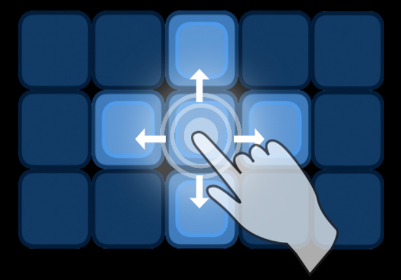
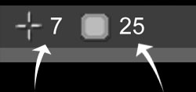
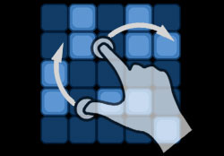
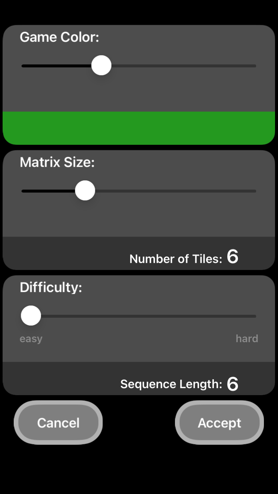

# LightBurst
A graphic puzzle game written in Objective C for the iPhone, iPad, and any iOS device, currently being reviewed by and soon to be available on the AppStore.


## Table of contents
<!-- 1. [Installation](#Installation)
2. [Usage](#Usage)
3. [Live Demo](#Live_Demo) -->
1. [Features](#Features)
2. [Technology](#Technology)
3. [Instructions](#Instructions)
4. [Usage Rights & Copyright](#Rights)

<!-- 3. [User Story](#User_Story)
4. [Contributors](#Contributors)
5. [Badges](#Badges) -->
<!-- 
<a name="Installation"></a>
## Installation
```sh
X-Code
```

<a name="Live_Demo"></a>
## Live Demo
<a href="https://shielded-crag-85117.herokuapp.com/">Live Demo on Heroku</a> -->

<a name="Features"></a>
## Features
1. Settings Panel allows user to adjust game panel size, color and game difficulty levels
2. Two-finger swipe rotates the game-board
3. Option for showing game solution / hint


<a name="Technology"></a>
## Technology
1. Objective C
2. ToolKit / iOS
3. X-Code

<!-- <a name="User_Story"></a>
## User Story
```sh
As an avid reader, I want to be able to store my own list of books that are available on Google Books, and then be able to easily access them at a later date.
``` -->
<a name="Instructions"></a>
## Instructions
The game board consists of a grid of tiles.  When the game starts, a sequence of these lights is switched on.  Pressing any of the tiles will toggle that tile and the four adjacent tiles on or off depending on their current state.  The goal of the puzzle is to switch off all the lights on the whole board with as few presses as possible.




  
If you get stuck and want to try again, this button will restart the current game with the original set of lights switched on, so you can try again from the begining.


  
If you get stuck and need help, pressing this button will show you the set of tiles that you need to press to get to the solution.  Note however that using this hint will greatly reduce your final score.


  
This button will bring up the settings control panel, which will allow you to change the color of the display, the number of tiles in the display, or increase the length of the sequene to make the game more challenging.


  
The number next to the LightBurst graphic shows the number of moves you have currently made in this game.  
The number next to the gray tile shows the length of the sequence that you are currently trying to solve.


  
Pressing the screen with two fingers and rotating, will rotate the board in that same direction.  Sometimes the board is easier to solve if you can change the orientation.

  
The Settings panel allows you to change the color of the game screen, the size of the matrix (a minimum of 4x4 or a max of 11x11), and the length of the sequence.  The larger the matrix, and the longer the sequence, the more challenging the puzzle is to solve.


<a name="Rights"></a>
## Usage Rights
All Rights reserved.  © Copyright 2020 by Bart Dority.

**on github:** <a href='github.com/b0rgBart3'>b0rgBart3</a>

[](https://github.com/remarkablemark)

Email: borgBart3@gmail.com

